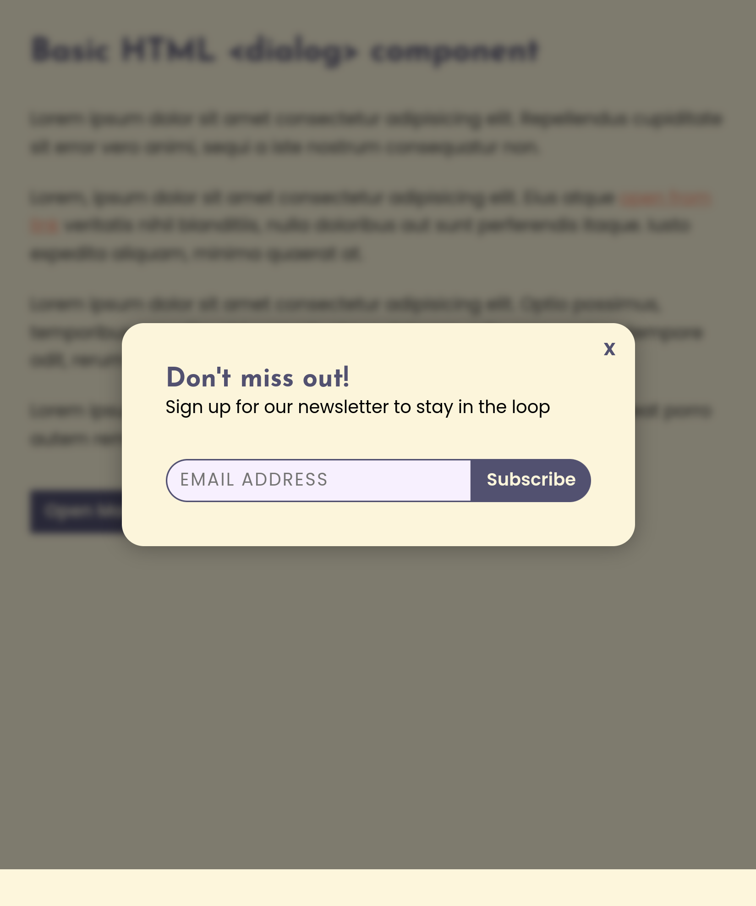

# Todo app concept with theme toggler

A small app concept idea just to sharpen some of my skills

## Table of contents

- Todo app concept with theme toggler
  - [Table of contents](#table-of-contents)
  - [Overview](#overview)
    - [The challenge](#the-challenge)
    - [Screenshot](#screenshot)
    - [Links](#links)
  - [My process](#my-process)
    - [Built with](#built-with)
    - [What I learned](#what-i-learned)
    - [Continued development](#continued-development)
      - [For this project](#for-this-project)
  - [Author](#author)

## Overview

### The challenge

Users should be able to:

- Open and close the dialog
- The app should autofocus first interactive element when the modal gets opened
- User should not be allowed to interact with rest of the page when modal is opened
- After the modal gets closed, the last active element should get focus
- It should be at least on button to close the modal (except the esc key)

### Screenshot

### Links

- Live Site URL: [View live demo](https://alinmercasi.github.io/simple-javascript-todo-app-with-theme-switcher-/)

## My process

### Built with

- Semantic HTML5 markup
- CSS Animations

### What I learned

- It helped me get some practice on how native dialog element works
- Make good use of CSS custom properties
- More practice with some javascript events, such as 'animationend'
- Make some practice with :not() and :has() css pseudo classes
- Make use of CSS animations, transforms and transitions

### Continued development

- Again, learn git! :)
- repeat(n, Be more organized) :)
- Practice, practice, practice!
  #### For this project
  - I would like to create some custom javascript events to use them on opening / closing instead of using html attributes
  - Add some more advanced animations
  - Trap focus inside the modal. I saw a lot of solutions out there, but I would like to came with my own

## Author

- Alin Mercasi
